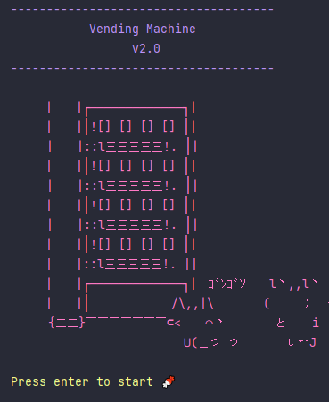
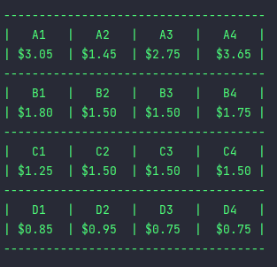
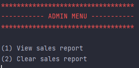

# Vending Machine CLI
  
  ## Description 
  A vending machine application built with Java following the completion of module 1 at Tech Elevator. The project encompasses my knowledge of object orientated programming and test driven development.

  ## Table of Contents
  * [Installation](#installation)
  * [Usage](#usage)
  * [Tests](#tests)
  * [Examples](#examples)
  * [Questions](#questions)

  ## Installation 
  Clone repository and open project in IntelliJ. Run the VendingMachineCLI file.

  ## Usage 
  Follow the on screen prompts to explore the project's functionality. Add money, purchase products and more. One can press 4 in the initial menu and enter the password 'lightship' to gain access to some hidden features such as viewing or clearing a running sales report.

  ## Tests
  All tests can be found in the 'test' directory and were written using JUnit.

  ## Examples

  

  

  

  ## Questions
  If you have any questions about this projects, please contact me directly at jonathanwthompson98@gmail.com. You can view more of my projects at https://github.com/jonnyfromralphs.
